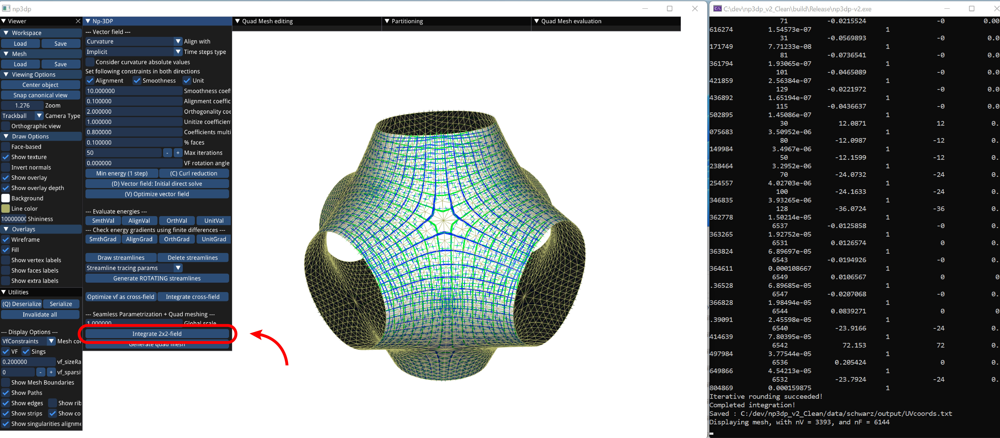

# SDQ_meshes

This repository contains the code used for the publication **Fabrication-aware strip-decomposable quadrilateral meshes**, by Ioanna Mitropoulou, Amir Vaxman, Olga Diamanti, Benjamin Dillenburger, published in Computer-Aided Design, Volume 168, 2024, [doi](https://doi.org/10.1016/j.cad.2023.103666).

In particular, the code implements;
* The vector field optimization method presented in that paper, where two transversal 2-fields are optimized jointly and integrated in two coupled strip networks (publication Section 4, see `vector_field.h`).
* The overlay of the two networks into a Strip-Decomposable Quad (SDQ) mesh (publication Section 4.4, see `quad_mesh.h`).
* Strip-based editing operations to fix topologic defects of the strip networks (publication Section 5, see `quad_mesh.h` and `strips.h`).
* Tracing paths on the strip network (publication Section 6.1, see `paths.h` and `paths_tracing.h`)

The dependencies of this code include [directional](https://avaxman.github.io/Directional/), [libhedra](https://avaxman.github.io/libhedra/), and [libigl](https://libigl.github.io/).

For questions feel free to contact the author Ioanna Mitropoulou: ioan.mitropoulou@gmail.com

---
## ⚠️ **Important Note** ⚠️

Following the recent cleanup and update to the latest libraries, a bug has been identified that affects high-genus geometries. This issue impacts the integration step required for seamless parametrization and is currently under investigation. Detailed information about this bug can be found in the following [issue](https://github.com/avaxman/Directional/issues/72).
As a result, the integration step will not work on complex models, such as those in `data/batwing` and `data/costa_minimal_surface_Complex`. I am actively working on resolving this issue.

---

## Applications 
The code was used to generate the print paths layout for the fabrication of a full-scale 2.0-meter tall thin shell geometry for the project [Fluid Forms](https://ioannamitropoulouarch.com/index.php/2023/10/24/fluid-forms-2023/). The print paths are aligned to principal curvature directions, and the rationale behind this choice has been described in the publication: (link to be added). 


In addition, the code has been used to generate the layout for the creation of the prototypes presented in the paper **Non-planar 3D Printing of Double Shells** (link to be added), presented in [RobARCH 2024](https://robarch2024.org/).


While SDQ meshes have been applied to nonplanar 3D printing, their underlying representation, which consists of two sets of orthogonal strips can be useful in numerous other fabrication scenarios. 
Examples of such scenarios include woven structures, surfaces from sheets in crossing directions, warp-weft fabrication, custom rebar, cable-net structures, and the design of secondary transversal structural elements on structural strip patterns.


## Installation
This code has been tested on Windows 10 and 11. To install on Windows download the repository and its submodules:

```console
git clone --recurse-submodules https://github.com/ioannaMitropoulou/SDQ_meshes.git
```

Then, go to the `SDQ_meshes` folder, open a shell and call:

```console
mkdir build
cd build
cmake ..
```

Note that [Matlab](https://www.mathworks.com/products/matlab.html) needs to be installed for the build to work. The code has been developed with Matlab 2021b.

## Information for usage

### Input command line arguments
One command line argument is required that points to the data folder where the inputs are saved. In that folder, there should be:
* a `mesh.obj` (input triangle mesh, with a good quality triangulation, scaled to fit within the unit sphere), 
* and a `scale_factor.txt` (with a single float number that determines the scale of the parametrization).
For examples of these, see the existing folders in the `data` folder. 

### Data and output folders
A library of examples can be found in the `data` folder. The types of geometries that work well with our method are relatively smooth and simple geometries with open boundaries, such as the ones included in the examples. 

When running each example, the results are visualized in the viewer. At the same time, an `output` folder created automatically in its folder, where all the output information is saved in various formats (mostly in .txt), and are available for further analysis. 

### Workflow
The following workflow must be followed to generate an SDQ mesh:

- Select parameters of input constraints. For example, the 'Align with' parameter allows to select between alignment with principal curvature directions (default option and most common scenario), boundaries, or constraints-from-file.
If constraints-from-file are selected, then these should be given into a file named `fvf_constraints.txt` that is positioned into the data folder. Each line should contain the constraint for a face in the format: `[fi x y z weight]`, where `fi` is the face index, `x y z` describe the constraint vector that is tangent on fi, and `weight` is the weight of that constraint. 
The example `data\curvy_surface` contains an  `fvf_constraints.txt` that will be loaded if the option `Aligned with > ConstraintsFromFile` is selected.


- Initialize vector field (key 'D'). Initializes the vector field and does a first direct solve of the energy. 


- Optimize vector field (key 'V'). Runs the iterative vector field optimization process.


- Integrate 2x2 field. Runs the seamless parametrization routine, and the results are displayed as texture on the original mesh. 



- Generate quad mesh. Once the quad mesh has been generated various new menus related to its editing, partitioning and evaluation are activated. 


- To view the separatrices of the singularities or to partition from singularities, you can find the buttons on the `Partitioning` menu.


- Once the partitions have been generated, paths subdividing each strip can also be traced from the same panel. These are, by default, aligned with the blue direction.


In many cases, singularities are nicely aligned by default, leading to a good partitioning out of the box. Then the workflow is complete at this point. In more complex shapes, however, singulartities might not be aligned, leading to winding strips that would be unfeasible for fabrication. In those cases, the editing operations can help solve the strip-based topological problems to create a good partitioning. 


Note that once a vector field has been optimized, or a quad mesh has been generated, the current state can be serialized (key 'Q') and deserialized using the buttons on the Utilities menu. 

The steps of the workflow can also be seen in the complementary videos from the paper submission (Appendix A, supplementary data). Note that the UI has small differences because it was cleaned up after the submission.

### Grasshopper visualization

If you would like to visualize the results within the Rhino-Grasshopper environment, you can open the `grasshopper/vizualization&debugging.gh` file. All the results that are saved in .txt format on the `output` folder can be loaded using python scripts. I always use grasshopper as a visualization and debugging tool in this way, because it allows me to better inspect the geometry, highlight, name and show/hide things interactively to find what I'm looking for. 


